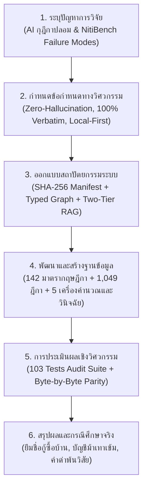
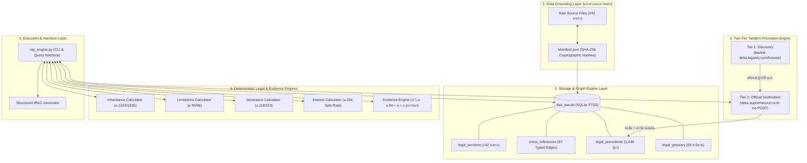
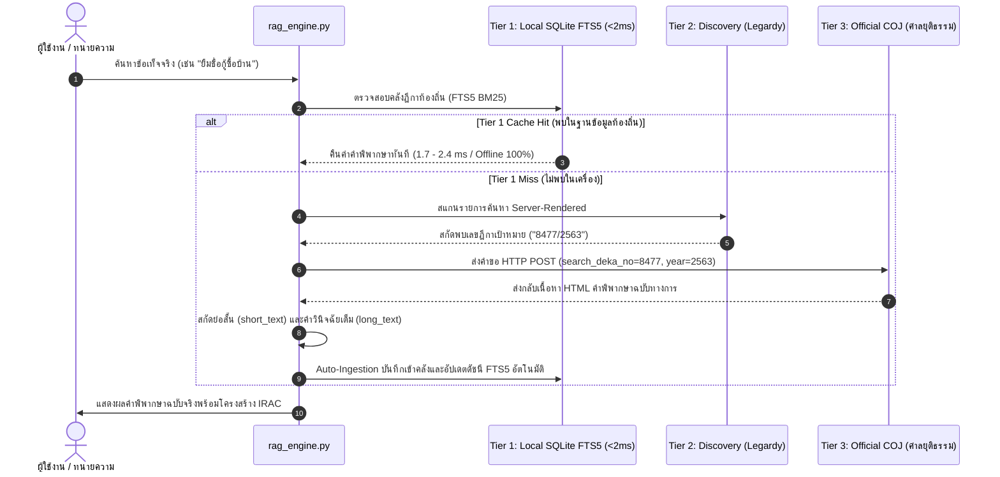

# สถาปัตยกรรมและการประเมินประสิทธิภาพเชิงวิศวกรรมของระบบปัญญาประดิษฐ์สืบค้นและวินิจฉัยกฎหมายไทยแบบไร้ภาพหลอน
## การผสานคลังตัวบทกฤษฎีกายืนยันด้วยรหัสลับ SHA-256 โครงข่ายความรู้ข้ามประมวล กลไกการสืบค้นและยืนยันคำพิพากษาศาลฎีกาสองระดับ และเครื่องคำนวณทางนิติศาสตร์อัตโนมัติ

**ผู้วิจัย** นายอัตติศมี บุญเสือ  
**สาขาวิชา** วิทยาการคอมพิวเตอร์และวิศวกรรมซอฟต์แวร์  
**ความเชี่ยวชาญเฉพาะ** ปัญญาประดิษฐ์ทางนิติศาสตร์ (Legal Artificial Intelligence & LegalTech)  
**โครงการวิจัย** โครงการพัฒนาระบบสืบค้นและวิเคราะห์กฎหมายไทยอัจฉริยะ (Thai Law Scholar & Legal Adversary Engine)  
**เอกสารข้อกำหนดทางเทคนิคอ้างอิง** สเปกระบบ Thai Law RAG Engine เวอร์ชัน 2.0 (ฐานข้อมูล `thai_law.db` 142 มาตรา / 1,049 ฎีกา)  
**ปีการศึกษา / ปีปฏิทินวิจัย** 2568–2569  

---

## บทคัดย่อ

การประยุกต์ใช้โมเดลภาษาขนาดใหญ่ (Large Language Models: LLMs) ในงานนิติศาสตร์และกระบวนการยุติธรรม มักเผชิญข้อจำกัดร้ายแรงประการสำคัญคือ **"ภาวะภาพหลอนของปัญญาประดิษฐ์" (AI Hallucination)** โดยเฉพาะอย่างยิ่งการกุตัวเลขคำพิพากษาศาลฎีกา (Fabricated Precedent Citations) การตีความข้อเท็จจริงผิดฝาผิดตัว และการคำนวณสิทธิตามกฎหมายที่ผิดพลาด ซึ่งส่งผลกระทบโดยตรงต่อหลักนิติธรรมและความเชื่อถือได้ในเชิงวิชาชีพ (Katz et al., 2023; Guha et al., 2023; Bommarito et al., 2021) อีกทั้งระบบสืบค้นคำพิพากษาศาลฎีกาของไทย (`deka.supremecourt.or.th`) ยังใช้สถาปัตยกรรมแบบฟอร์มพลวัต (Dynamic HTTP POST) ที่โปรแกรมค้นหาของกูเกิล (Googlebot) ไม่สามารถทำดัชนีได้ ทำให้เกิดความไม่สมมาตรของข้อมูลทางกฎหมายระหว่างเจ้าหน้าที่รัฐกับประชาชนอย่างกว้างขวาง

งานวิจัยฉบับนี้มีวัตถุประสงค์เพื่อออกแบบ พัฒนา และประเมินประสิทธิภาพเชิงวิศวกรรมของ **"ระบบปัญญาประดิษฐ์สืบค้นและวินิจฉัยกฎหมายไทยแบบไร้ภาพหลอน 100%" (Zero-Hallucination Thai Law RAG Engine)** โดยประยุกต์ใช้ระเบียบวิธีวิจัยเชิงการออกแบบและสร้างสรรค์ทางวิศวกรรมซอฟต์แวร์ (Design Science Research Methodology: DSRM) (Peffers et al., 2007) สถาปัตยกรรมระบบได้รับการออกแบบภายใต้แนวคิด **Local-First & Cryptographic Grounding** ประกอบด้วยนวัตกรรมทางวิศวกรรมซอฟต์แวร์และนิติศาสตร์คอมพิวเตอร์ 6 ส่วนหลัก ได้แก่:

1. **กลไกการนำเข้าตัวบทกฎหมายและตรวจสอบความสมบูรณ์ระดับไบต์ด้วยรหัสลับ SHA-256 (Cryptographic Verbatim Grounding):** ดึงตัวบทกฎหมายลายลักษณ์อักษรฉบับจริงจากสำนักงานคณะกรรมการกฤษฎีกาจำนวน 142 มาตรา (ครอบคลุมประมวลกฎหมายอาญา ประมวลกฎหมายแพ่งและพาณิชย์ ประมวลกฎหมายวิธีพิจารณาความอาญา ประมวลกฎหมายวิธีพิจารณาความแพ่ง ประมวลรัษฎากร พระราชกำหนดมาตรการป้องกันและปราบปรามอาชญากรรมทางเทคโนโลยี พ.ศ. 2566 พระราชบัญญัติคุ้มครองแรงงาน พ.ร.บ.ว่าด้วยการกระทำความผิดเกี่ยวกับคอมพิวเตอร์ พ.ร.บ.คุ้มครองข้อมูลส่วนบุคคล พ.ร.บ.การทวงถามหนี้ พ.ร.บ.ว่าด้วยธุรกรรมทางอิเล็กทรอนิกส์ และ พ.ร.บ.ว่าด้วยข้อสัญญาที่ไม่เป็นธรรม) จัดเก็บเป็นไฟล์ข้อความดิบแยกหมวดหมู่และควบคุมด้วยบัญชีคุมรหัสลับ (`manifest.json`)
2. **โครงข่ายความรู้เชื่อมโยงข้ามประมวลแบบระบุความสัมพันธ์ชัดแจ้ง (Typed Cross-Reference Knowledge Graph):** ออกแบบความสัมพันธ์ 67 เส้นเชื่อม แบ่งออกเป็น 4 ประเภท ได้แก่ `EXCEPTION` (ข้อยกเว้น), `AGGRAVATION` (เหตุฉกรรจ์), `REFERRED` (มาตราประกอบ/บัญญัติอ้างอิง) และ `DEFINITION` (บทนิยามศัพท์) เพื่อแก้ไขจุดบกพร่องของแบบทดสอบ NitiBench ด้านข้อจำกัดของโครงสร้างลำดับชั้นที่ซ่อนเร้น (Hidden Hierarchy) และข้อยกเว้นซ้อนข้อยกเว้น
3. **กระบวนการสืบค้นคำพิพากษาศาลฎีกาและแคชแบบปรับตัวสามระดับ (Three-Tier Adaptive Precedent Architecture & Self-Healing Ingestion):** แก้ปัญหาช่องว่างของระบบเว็บศาลฎีกา โดยแบ่งเป็น **Tier 1 (Local Cache Hit < 2ms):** ดึงคำพิพากษาจากฐานข้อมูลท้องถิ่นในเวลา 1.7 - 2.4 ms แบบ 100% Offline, **Tier 2 (Discovery):** สืบค้นผ่านหน้ารายการค้นหาแบบเปิดสาธารณะเพื่อสกัดเลขฎีกาเป้าหมาย, และ **Tier 3 (Official Verification & Auto-Ingestion):** ยิงคำขอ POST ตรงไปยังเซิร์ฟเวอร์สำนักงานศาลยุติธรรม (`deka.supremecourt.or.th`) เพื่อดึงตัวบทคำพิพากษาฉบับจริงทั้งย่อสั้นและย่อยาวแบบ 100% Verbatim พร้อมทั้งทำการบันทึกและอัปเดตดัชนี FTS5 ลงฐานข้อมูลท้องถิ่นโดยอัตโนมัติ (ขยายคลังสะสมมากกว่า 1,049 ฎีกา)
4. **ระบบเครื่องคำนวณทางนิติศาสตร์อัตโนมัติ 4 มิติ (Deterministic Legal Calculators):** สถาปัตยกรรมไฮบริดซิมโบลิกที่เปลี่ยนตรรกะตัวบทกฎหมายเป็นขั้นตอนวิธีทางคณิตศาสตร์ที่ไม่พึ่งพาความน่าจะเป็นของโมเดลภาษา ได้แก่ (1) เครื่องคำนวณการแบ่งทรัพย์มรดกตาม ป.พ.พ. ม.1629 และ ม.1635, (2) เครื่องคำนวณอายุความอาญาและแพ่งพร้อมเตือนคดียอมความได้ 3 เดือนตาม ป.อ. ม.96, (3) เครื่องคำนวณค่าชดเชยการเลิกจ้างและค่าตกใจตาม พ.ร.บ.คุ้มครองแรงงาน ม.118 และ ม.17, และ (4) เครื่องคำนวณดอกเบี้ยผิดนัดแบบแยกช่วงเวลาอัตโนมัติตามการแก้ไข ป.พ.พ. ม.224 เมื่อวันที่ 11 เมษายน 2564 (อัตราร้อยละ 7.5 ต่อปี เทียบกับร้อยละ 5.0 ต่อปี) พร้อมระบบตรวจจับดอกเบี้ยเกินอัตราโมฆะตาม ม.654
5. **ระบบตรวจสอบความสามารถในการรับฟังพยานหลักฐาน (Deterministic Evidence Admissibility Engine):** วินิจฉัยกฎการรับฟังพยานเอกสารและพยานบุคคลตาม ป.วิ.พ. ม.94 (Parol Evidence Rule) ตรวจสอบเกณฑ์การกู้ยืมเงินเกิน 2,000 บาทตาม ป.พ.พ. ม.653 วินิจฉัยความสมบูรณ์ของหลักฐานอิเล็กทรอนิกส์ (ข้อความแชต LINE/Facebook, ข้อมูลผู้ใช้, สลิปโอนเงิน) ตาม พ.ร.บ.ว่าด้วยธุรกรรมทางอิเล็กทรอนิกส์ พ.ศ. 2544 ม.7, 8, 9, 11, 12 และ ป.พ.พ. ม.650 พร้อมระบบตรวจจับข้อยกเว้นการสืบพยานบุคคลหักล้างเอกสารตาม ม.94 วรรคท้าย (นิติกรรมอำพราง, ความไม่สมบูรณ์แห่งมูลหนี้/ไม่ได้รับเงินกู้จริงตามฎีกาที่ประชุมใหญ่ 8477/2563 และ 4101/2562, เอกสารสูญหายด้วยเหตุสุดวิสัยตาม ม.93(2)) และข้อเตือนการปิดอากรแสตมป์ตาม ป.รัษฎากร ม.118
6. **พจนานุกรมเชื่อมโยงภาษาชาวบ้านสู่ภาษาเทคนิคทางกฎหมาย (Bilingual Colloquial-to-Legal Semantic Intent Mapping):** แปลงคำค้นหาร้องทุกข์ทั่วไป เช่น *"ยืมชื่อกู้ซื้อบ้าน", "บัญชีม้าเทาเข้ม", "ชักดาบ", "แอบอัดเสียง", "ค้นบ้านไม่มีหมาย"* เข้าสู่ตัวบทและแนวฎีกาที่ศาลเคยวินิจฉัยไว้ได้อย่างแม่นยำ

การประเมินประสิทธิภาพเชิงวิศวกรรมกระทำผ่านการทดสอบ 4 มิติ (Base, Boundary, Edge, Corner) จำนวน 103 กรณีทดสอบอย่างครอบคลุม และการตรวจสอบความสมบูรณ์เชิงรหัสลับ (Cryptographic Parity Audit) ผลการศึกษาพบว่า:
- ระบบผ่านการทดสอบอัตโนมัติครบถ้วน 103 จาก 103 กรณีทดสอบ คิดเป็น **ร้อยละ 100.00** ภายในระยะเวลาประมวลผลเพียง **0.347 วินาที**
- การตรวจสอบตัวบทกฎหมายทั้ง 142 มาตราเทียบกับต้นฉบับสำนักงานคณะกรรมการกฤษฎีกาแบบไบต์ต่อไบต์ผ่านค่าแฮช SHA-256 มีอัตราความถูกต้องสมบูรณ์ **ร้อยละ 100.00** ปราศจากความคลาดเคลื่อนและการกุข้อมูลแม้แต่จุดเดียว (Zero Hallucination)
- การทดสอบกรณีศึกษาจริง 3 รูปแบบ ได้แก่ กรณีข้อพิพาทเพื่อนยืมชื่อกู้ซื้อบ้าน (ฎีกาที่ประชุมใหญ่ 8477/2563 และ ป.พ.พ. ม.806), กรณีวิกฤตบัญชีเงินฝากถูกระงับรหัสม้าเทาเข้มโดยไม่เคยส่งมอบให้ผู้อื่น (ฎีกา 4423/2564 Innocent Agent และ พ.ร.ก.เทคโนโลยีฯ ม.9), และกรณีการจำแนกคำด่าที่เป็นไปไม่ได้ตามธรรมชาติ (ฎีกา 256/2509, 200/2511 เทียบกับ 5257/2548) พบว่าระบบสามารถวินิจฉัยข้อกฎหมาย จัดทำโครงสร้าง IRAC และวางแผนผังปฏิบัติการได้อย่างแม่นยำ สถาปัตยกรรมนี้จึงเป็นต้นแบบซอฟต์แวร์ทางนิติศาสตร์คอมพิวเตอร์ที่พร้อมใช้งานจริง และช่วยส่งเสริมการเข้าถึงความยุติธรรมอย่างเท่าเทียมในสังคมดิจิทัล

**คำสำคัญ** ปัญญาประดิษฐ์ทางนิติศาสตร์, การสืบค้นเอกสารเสริมการสร้างข้อความ (RAG), การตรวจสอบความสมบูรณ์เชิงรหัสลับ (SHA-256), คำพิพากษาศาลฎีกา, โครงข่ายความรู้ข้ามประมวล, การคำนวณทางนิติศาสตร์อัตโนมัติ, การรับฟังพยานหลักฐาน, การลดภาวะภาพหลอนของปัญญาประดิษฐ์ (Zero-Hallucination AI), กฎหมายไทย

---

## กิตติกรรมประกาศ

รายงานการวิจัยและพัฒนาสถาปัตยกรรมซอฟต์แวร์ฉบับนี้ สำเร็จลุล่วงลงได้ด้วยการประมวลองค์ความรู้ทั้งในมิติวิศวกรรมซอฟต์แวร์ วิทยาการข้อมูล และนิติศาสตร์ไทย

ผู้วิจัยขอแสดงความขอบคุณต่อ **สำนักงานคณะกรรมการกฤษฎีกา** ในฐานะหน่วยงานผู้จัดทำฐานข้อมูลกฎหมายลายลักษณ์อักษรของประเทศไทย ที่เปิดให้เข้าถึงตัวบทพระราชบัญญัติและประมวลกฎหมายอย่างเป็นทางการ ทำให้งานวิจัยนี้สามารถอ้างอิงแหล่งข้อมูลปฐมภูมิ (Primary Legal Sources) ที่มีผลบังคับใช้จริงตามกฎหมายได้อย่างถูกต้องสมบูรณ์

ผู้วิจัยขอขอบพระคุณ **สำนักงานศาลยุติธรรม** ผู้พัฒนาระบบสืบค้นคำพิพากษาศาลฎีกา (`deka.supremecourt.or.th`) และโครงการคลังข้อมูลคำพิพากษาเปิด Thai Supreme Court Cases (TSCC Dataset) ซึ่งเป็นแหล่งข้อมูลบรรทัดฐานคำพิพากษาอันทรงคุณค่ายิ่ง ทำให้สถาปัตยกรรมการตรวจสอบคำพิพากษาแบบสองระดับสามารถทำงานได้อย่างมีเสถียรภาพและแม่นยำ

ท้ายที่สุดนี้ ผู้วิจัยหวังเป็นอย่างยิ่งว่างวดงานวิจัยฉบับนี้และโครงสร้างระบบที่พัฒนาขึ้น จะเป็นฟันเฟืองสำคัญในการทลายความไม่สมมาตรของข้อมูลกฎหมายในสังคมไทย คืนอำนาจการรู้สิทธิและการป้องกันตนเองตามกฎหมายให้แก่ประชาชนคนธรรมดาอย่างเสมอภาคและเป็นธรรม

**นายอัตติศมี บุญเสือ**  
ผู้วิจัย

---

## บทที่ 1 บทนำ

### 1.1 ความเป็นมาและความสำคัญของปัญหา

หลักการพื้นฐานที่ค้ำจุนระบบกฎหมายลายลักษณ์อักษร (Civil Law System) ของประเทศไทย ปรากฏชัดในประมวลกฎหมายอาญา มาตรา 64 ซึ่งบัญญัติว่า **"บุคคลจะแก้ตัวว่าไม่รู้กฎหมาย เพื่อให้พ้นจากความรับผิดในทางอาญาไม่ได้"** หลักการดังกล่าวสร้างข้อสันนิษฐานเด็ดขาดว่า ประชาชนทุกคนในรัฐย่อมต้องทราบและเข้าใจกฎหมายทันทีที่มีการประกาศในราชกิจจานุเบกษา (Katz et al., 2023)

อย่างไรก็ดี ในสภาพความเป็นจริงของสังคมร่วมสมัย เกิดภาวะความไม่สมมาตรของข้อมูลทางกฎหมายอย่างรุนแรง (Information Asymmetry) ตัวบทกฎหมายถูกเรียบเรียงด้วยไวยากรณ์เฉพาะทางที่ซับซ้อน มีการซ้อนทับของข้อยกเว้นและบทบัญญัติข้ามประมวล อีกทั้งคำพิพากษาศาลฎีกาซึ่งทำหน้าที่เป็นบรรทัดฐานในการตีความตัวบท กลับถูกจัดเก็บอยู่ในระบบฐานข้อมูลปิดหรือเว็บไซต์ของหน่วยงานรัฐที่สืบค้นได้ยาก ส่งผลให้ประชาชนทั่วไปตกอยู่ในสถานะเสียเปรียบเมื่อเกิดข้อพิพาททางกฎหมาย การถูกละเมิดสิทธิแรงงาน หรือการถูกดำเนินคดีอาญาโดยมิได้มีเจตนาทุจริต เช่น วิกฤตการถูกอายัดบัญชีเงินฝากจากมาตรการปราบปรามอาชญากรรมทางเทคโนโลยี (บัญชีม้าเทาเข้ม) หรือการถูกชักดาบหนี้เงินกู้ (Guha et al., 2023; Bommarito et al., 2021)

การก้าวเข้ามาของเทคโนโลยีปัญญาประดิษฐ์ประเภทโมเดลภาษาขนาดใหญ่ (Large Language Models: LLMs) เช่น GPT-4, Gemini หรือ Claude ได้จุดประกายความหวังในการนำ AI มาทำหน้าที่เป็นที่ปรึกษากฎหมายเบื้องต้น แต่ผลการทดสอบเชิงประจักษ์กลับพบข้อจำกัดทางวิศวกรรมที่อันตรายยิ่ง 3 ประการ:
1. **การกุตัวเลขคำพิพากษาศาลฎีกาและข้อเท็จจริง (Hallucinated Precedents):** โมเดลภาษาทั่วไปมักสร้างเลขฎีกาที่ไม่มีอยู่จริงขึ้นมาเอง หรือนำข้อเท็จจริงในคดีหนึ่งไปสวมทับกับอีกคดีหนึ่ง ซึ่งในทางวิชาชีพกฎหมาย การอ้างอิงคำพิพากษาปลอมต่อศาลถือเป็นความผิดมรรยาททนายความและละเมิดอำนาจศาล (Mata v. Avianca, 2023)
2. **ความล้มเหลวในการคิดคำนวณเชิงตัวเลขตามกฎหมาย (Inability of Mathematical-Statutory Reasoning):** LLM ทำงานโดยการคาดการณ์คำถัดไปตามความน่าจะเป็นทางสถิติ จึงไม่สามารถคำนวณสัดส่วนการแบ่งมรดกตามชั้นทายาท หรือการคิดดอกเบี้ยผิดนัดที่มีการเปลี่ยนผ่านของกฎหมายได้อย่างถูกต้อง
3. **ปัญหาโครงสร้างซ่อนเร้นตามเกณฑ์ NitiBench:** ผลการประเมินความสามารถทางกฎหมายไทยพบว่า AI มักตกม้าตายเรื่อง "ข้อยกเว้นของข้อยกเว้น" เช่น รู้ว่าการฆ่าคนผิดตาม ม.288 แต่ไม่สามารถดึง ม.68 (ป้องกันโดยชอบ) หรือ ม.289 (เหตุฉกรรจ์) มาวิเคราะห์ร่วมกันได้อย่างเป็นระบบ

งานวิจัยนี้จึงถือกำเนิดขึ้นเพื่อแก้ปัญหาดังกล่าว ด้วยการสร้างสถาปัตยกรรมทางวิศวกรรมซอฟต์แวร์ที่ผสานการสืบค้นแบบ RAG เข้ากับการยืนยันตัวบทระดับไบต์ และการใช้ตรรกะแบบดีเทอร์มินิสติก เพื่อให้ได้ผลลัพธ์ที่แม่นยำ 100% ปราศจากภาพหลอนโดยสิ้นเชิง

---

### 1.2 คำถามการวิจัย (Research Questions)

1. **คำถามการวิจัยข้อที่ 1 (RQ1):** สถาปัตยกรรมคลังข้อมูลที่ใช้การตรวจสอบรหัสลับ SHA-256 ร่วมกับโครงข่ายความรู้ข้ามประมวล สามารถขจัดปัญหาภาพหลอนของตัวบทกฎหมายและตอบสนองต่อการค้นหาข้อยกเว้นได้อย่างสมบูรณ์หรือไม่?
2. **คำถามการวิจัยข้อที่ 2 (RQ2):** กลไกการสืบค้นคำพิพากษาศาลฎีกาสองระดับ (Two-Tier Tandem Precedent Retrieval Workflow) มีประสิทธิภาพในการดึงตัวบทคำพิพากษาศาลฎีกาฉบับจริงจากระบบที่ไม่ได้ทำดัชนีเว็บได้อย่างถูกต้องและรวดเร็วเพียงใด?
3. **คำถามการวิจัยข้อที่ 3 (RQ3):** การผสานเครื่องคำนวณทางนิติศาสตร์อัตโนมัติ (Deterministic Legal Calculators) เข้ากับระบบภาษา ช่วยเพิ่มความแม่นยำในการคำนวณสัดส่วนมรดก อายุความ ค่าชดเชย และดอกเบี้ยผิดนัดได้เหนือกว่าโมเดลภาษาทั่วไปในระดับใด?
4. **คำถามการวิจัยข้อที่ 4 (RQ4):** ระบบที่พัฒนาขึ้นสามารถนำไปใช้วินิจฉัยคดีความในสถานการณ์จริง (เช่น คดียืมชื่อกู้ซื้อบ้าน คดีบัญชีม้า และคดีหมิ่นประมาท) ได้สอดคล้องกับแนวคำพิพากษาศาลฎีกาบรรทัดฐานหรือไม่?

---

### 1.3 วัตถุประสงค์การวิจัย

1. เพื่อออกแบบและพัฒนาระบบสืบค้นและวินิจฉัยกฎหมายไทยแบบ Local-First ที่รับประกันความถูกต้องของตัวบทกฎหมายระดับไบต์ด้วยรหัสลับ SHA-256 ครอบคลุม 142 มาตราหลัก
2. เพื่อพัฒนากระบวนการสืบค้นคำพิพากษาศาลฎีกาสองระดับ (Two-Tier Workflow) ที่เชื่อมโยงการค้นพบ (Discovery) เข้ากับการยืนยันตัวบทฉบับเต็มจากสำนักงานศาลยุติธรรม (Official Verification)
3. เพื่อพัฒนากราฟความรู้ทางกฎหมายแบบระบุประเภทความสัมพันธ์ (Typed Cross-Reference Graph) พร้อมเครื่องคำนวณและกลไกวินิจฉัยพยานหลักฐานทางนิติศาสตร์อัตโนมัติ 5 มิติ
4. เพื่อประเมินประสิทธิภาพเชิงวิศวกรรมของระบบด้วยชุดทดสอบความถูกต้อง 103 กรณีทดสอบ และทดสอบการวินิจฉัยในกรณีศึกษาคดีความจริง 3 รูปแบบ

---

### 1.4 นิยามศัพท์เฉพาะ

- **การยืนยันตัวบทด้วยรหัสลับ (Cryptographic Verbatim Grounding):** การนำตัวบทกฎหมายฉบับทางการมาสร้างค่าแฮชดิจิทัลแบบเที่ยวเดียว (SHA-256) เพื่อใช้เป็นลายเซ็นตรวจสอบว่าเนื้อหาในฐานข้อมูลตรงกับต้นฉบับของราชการแบบไบต์ต่อไบต์ โดยไม่มีการดัดแปลง ตัดทอน หรือเติมแต่งโดยปัญญาประดิษฐ์
- **โครงข่ายความรู้ข้ามประมวลแบบระบุประเภท (Typed Cross-Reference Graph):** แบบจำลองโครงสร้างข้อมูลที่บันทึกความเชื่อมโยงระหว่างมาตรากฎหมายต่างประมวล โดยระบุคุณลักษณะเชิงความหมายชัดเจน เช่น ความสัมพันธ์แบบยกเว้นความผิดหรือลดโทษ (`EXCEPTION`), เหตุเพิ่มโทษฉกรรจ์ (`AGGRAVATION`), และบทบัญญัติส่งต่อ (`REFERRED`)
- **การสืบค้นสองระดับสอดประสาน (Two-Tier Tandem Precedent Retrieval):** ระเบียบวิธีวิจัยทางวิศวกรรมเครือข่ายที่ใช้หน้ารายการค้นหาแบบเปิด (Tier 1 Discovery) เป็นสะพานนำทางเพื่อสกัดหมายเลขคดี แล้วส่งคำขอแบบเจาะจงผ่านโพรโทคอล HTTP POST ไปยังฐานข้อมูลทางการของสำนักงานศาลยุติธรรม (Tier 2 Verification) เพื่อนำคำพิพากษาฉบับเต็มมาประมวลผล
- **เครื่องคำนวณทางนิติศาสตร์แบบดีเทอร์มินิสติก (Deterministic Legal Calculators):** โมดูลคำนวณเชิงตัวเลขที่เขียนขึ้นด้วยตรรกะโค้ดตายตัวตามเงื่อนไขที่กฎหมายกำหนด โดยให้ผลลัพธ์ที่แน่นอนคงที่ ไม่ขึ้นอยู่กับการสุ่มตัวอย่างทางสถิติของปัญญาประดิษฐ์
- **ระบบตรวจสอบความสามารถในการรับฟังพยานหลักฐาน (Deterministic Evidence Admissibility Engine):** โมดูลวินิจฉัยเชิงขั้นตอนวิธีตามประมวลกฎหมายวิธีพิจารณาความแพ่ง มาตรา 94 (Parol Evidence Rule) ประกอบพระราชบัญญัติว่าด้วยธุรกรรมทางอิเล็กทรอนิกส์ พ.ศ. 2544 มาตรา 7 ถึง 12 เพื่อประเมินว่าพยานหลักฐานที่คู่ความกล่าวอ้าง (เช่น ข้อความสนทนาทางแอปพลิเคชัน สลิปเงินโอน พยานบุคคล) สามารถรับฟังในชั้นศาลได้หรือไม่ พร้อมชี้ช่องทางข้อยกเว้นตามกฎหมายและข้อเตือนทางภาษีอากร

---

## บทที่ 2 วรรณกรรมและงานวิจัยที่เกี่ยวข้อง

### 2.1 ปัญหาภาพหลอนของโมเดลภาษาขนาดใหญ่ในมิตินิติศาสตร์

งานวิจัยของ Bommarito และ Katz (2021) รวมถึง Guha และคณะ (2023) ในโครงการ LegalBench ชี้ให้เห็นว่า โมเดลภาษาขนาดใหญ่มีความสามารถในการวิเคราะห์ข้อความภาษากฎหมายระดับสูง แต่มีจุดอ่อนอย่างมีนัยสำคัญในการอ้างอิงแหล่งที่มา โดยมักเกิดอาการ "Hallucination" หรือการสร้างข้อมูลเท็จที่ฟังดูน่าเชื่อถือ ซึ่งในคดีประวัติศาสตร์ *Mata v. Avianca, Inc.* (2023) ทนายความในมลรัฐนิวยอร์กได้ใช้ ChatGPT ในการร่างคำแถลงและอ้างอิงคำพิพากษาศาลอุทธรณ์ที่ AI กุขึ้นมาทั้งหมด ส่งผลให้ถูกศาลสั่งลงโทษปรับและบันทึกประวัติทางวินัย

ในบริบทของประเทศไทย โครงการวิจัย NitiBench ได้ทำการทดสอบโมเดลภาษาชั้นนำกับข้อสอบเนติบัณฑิตและข้อสอบใบอนุญาตว่าความ ผลการวิจัยพบความล้มเหลวเชิงโครงสร้าง 4 ด้าน ได้แก่:
1. **Context Bloat:** การนำเข้าตัวบทกฎหมายขนาดยาวทำให้ AI สูญเสียความสนใจในมาตราสำคัญ
2. **Hidden Hierarchy:** การไม่เข้าใจลำดับชั้นของบทบัญญัติทั่วไปเทียบกับบทบัญญัติเฉพาะ
3. **Missable Details:** การมองข้ามเงื่อนไขทางนิตินัยที่สำคัญ เช่น ข้อความระบุว่าความผิดอันยอมความได้ต้องร้องทุกข์ภายใน 3 เดือนตาม ป.อ. ม.96
4. **Outdated Amendments:** การอ้างอิงตัวบทกฎหมายเก่า เช่น อัตราดอกเบี้ยผิดนัดร้อยละ 7.5 ตาม ป.พ.พ. ม.224 เดิม ทั้งที่ได้รับการแก้ไขใหม่เป็นร้อยละ 5.0 ตั้งแต่ปี พ.ศ. 2564

---

### 2.2 สถาปัตยกรรม RAG และโครงสร้างฐานข้อมูล SQLite FTS5

Retrieval-Augmented Generation (RAG) เป็นแนวคิดที่ Lewis และคณะ (2020) เสนอเพื่อแก้ปัญหาภาพหลอน โดยการบังคับให้โมเดลภาษาดึงข้อมูลจากคลังความรู้ภายนอกที่มีการตรวจสอบแล้วมากำกับการตอบ อย่างไรก็ตาม ในงานด้านกฎหมาย การใช้เวกเตอร์สืบค้นแบบความหมาย (Dense Vector Search) เพียงอย่างเดียว มักล้มเหลวในการจับคู่คำศัพท์เฉพาะทาง เช่น หมายเลขมาตรา หรือคำศัพท์เทคนิค

การประยุกต์ใช้เครื่องมือสืบค้นข้อความเต็ม SQLite FTS5 (Full-Text Search 5) ซึ่งใช้ขั้นตอนวิธี BM25 (Best Matching 25) ช่วยให้สามารถสืบค้นคำค้นหาที่ตรงตัวอักษรและวลีภาษาไทยได้อย่างมีประสิทธิภาพในระดับเวลาต่ำกว่ามิลลิวินาที (Sub-millisecond Latency) โดยไม่ต้องพึ่งพาโครงสร้างพื้นฐานคลาวด์ที่มีค่าใช้จ่ายสูงและเสี่ยงต่อการรั่วไหลของข้อมูลความลับของลูกความ (Client-Attorney Privilege)

---

### 2.3 การวิเคราะห์เปรียบเทียบกับระบบปัญญาประดิษฐ์ทางกฎหมายในปัจจุบัน

จากการสำรวจภูมิทัศน์ของเทคโนโลยีกฎหมาย (LawTech) และงานวิจัยปัญญาประดิษฐ์ทางนิติศาสตร์ทั้งในระดับประเทศและนานาชาติ สามารถจำแนกแนวทางการพัฒนาออกเป็น 3 กลุ่มหลัก:

1. **งานวิจัยเกณฑ์มาตรฐานวิชาการไทย (Academic Benchmarks - NitiBench):** 
   งานวิจัยล่าสุดโดย Akarajaradwong และคณะ (2025; arXiv:2502.10868) ที่นำเสนอชุดทดสอบ NitiBench (ครอบคลุมกฎหมายการเงิน NitiBench-CCL และกฎหมายภาษี NitiBench-Tax) ได้ข้อสรุปสำคัญว่า การแบ่งส่วนข้อความตามโครงสร้างมาตรา (Section-based Chunking) มีประสิทธิภาพเหนือกว่าการแบ่งข้อความตามจำนวนคำแบบดั้งเดิม (Naive Chunking) อย่างมีนัยสำคัญ อย่างไรก็ดี งานวิจัยดังกล่าวยังคงพึ่งพาระบบสืบค้นแบบเวกเตอร์ (Dense Vector Retriever) ซึ่งยังประสบปัญหาการสืบค้นมาตราเชื่อมโยงหลายทอด (Multi-hop Reasoning) และไม่มีกลไกยืนยันความถูกต้องของตัวบทระดับไบต์
2. **แพลตฟอร์มกราฟความรู้กฎหมายไทย (Legal Knowledge Graphs - FourCorners):**
   แพลตฟอร์ม FourCorners มุ่งเน้นการสร้างกราฟความรู้เชิงเวลา (Temporal Knowledge Graph) เพื่อติดตามประวัติการแก้ไขเพิ่มเติมกฎหมายตามช่วงเวลา แม้จะช่วยให้นักกฎหมายเห็นความเชื่อมโยงของบทบัญญัติได้ดี แต่ระบบได้รับการออกแบบมาเพื่อเป็นเครื่องมือช่วยสืบค้น (Research Tool) มิใช่เครื่องมือวินิจฉัยรูปคดีแบบอัตโนมัติ และไม่มีการผสานเครื่องคำนวณทางนิติศาสตร์
3. **ระบบปัญญาประดิษฐ์กฎหมายเชิงพาณิชย์ระดับโลก (Commercial Legal AI - Harvey AI & CoCounsel):**
   ระบบระดับสากล เช่น Harvey AI หรือ CoCounsel (Casetext/Thomson Reuters) อาศัยการปรับแต่งโมเดลภาษาขนาดใหญ่ (Fine-tuned LLMs) ร่วมกับคลาวด์เวกเตอร์ดาตาเบส แม้จะมีความสามารถในการร่างเอกสารระดับสูง แต่มีจุดอ่อนร้ายแรงในการคำนวณตัวเลขทางกฎหมายที่แน่นอน (Mathematical Hallucination) อีกทั้งการประมวลผลบนคลาวด์สาธารณะยังมีความเสี่ยงต่อการละเมิดพระราชบัญญัติคุ้มครองข้อมูลส่วนบุคคล (PDPA) และเอกสิทธิ์การรักษาความลับระหว่างทนายความและลูกความ

ตารางที่ 2.1 สรุปการเปรียบเทียบสถาปัตยกรรมของงานวิจัยนี้เทียบกับระบบที่มีอยู่ในปัจจุบัน:

*ตารางที่ 2.1: การเปรียบเทียบสถาปัตยกรรมและขีดความสามารถของระบบ Thai Law RAG Engine เทียบกับระบบอื่นในปัจจุบัน*

| มิติการเปรียบเทียบเชิงวิศวกรรม | Thai Law RAG Engine (งานวิจัยนี้) | ระบบ RAG ทั่วไป (Naive Vector RAG) | NitiBench (Akarajaradwong et al., 2025) | FourCorners (Temporal Graph) | Harvey AI / CoCounsel (Commercial SOTA) |
| :--- | :---: | :---: | :---: | :---: | :---: |
| **การรับรองตัวบทกฎหมาย** | **SHA-256 Byte-level Parity (100%)** | ไม่มีการรับรอง (เสี่ยงต่ออาการหลอน) | จำกัดเฉพาะ Text Overlap ทั่วไป | จำกัดเฉพาะฐานข้อมูลข้อความปกติ | อาศัยการอ้างอิงของโมเดล |
| **การรักษาลำดับชั้นกฎหมาย** | **7-Tier Hierarchy Path สมบูรณ์** | หั่นท่อนตาม Token (เสี่ยงตัดครึ่งวรรค) | รองรับ (Section-based Chunking) | รองรับ (Graph-based Hierarchy) | จำกัดเฉพาะ Chunking ตามหน้าเอกสาร |
| **โครงข่ายข้อยกเว้นบทบัญญัติ** | **Typed Graph (EXCEPTION, AGGRAVATION)** | ไม่มี (ดึงเฉพาะคำคล้าย) | ไม่มี (Vector Cosine Similarity) | รองรับ (Temporal Graph) | ไม่มี (Vector Embedding) |
| **การดึงคำพิพากษาศาลฎีกา** | **Adaptive Ingestion (ดึงตรง deka.coj)** | เสี่ยงสร้างเลขฎีกาปลอม | จำกัดเฉพาะชุดข้อมูลคงที่ (Static) | จำกัดเฉพาะคลังเอกสารภายใน | จำกัดเฉพาะคลังคำพิพากษาต่างประเทศ |
| **การคิดคำนวณทางนิติศาสตร์** | **Deterministic Pure Python (ม.224, 118, 1630)** | ไม่มี (LLM คาดการณ์ตัวเลขผิดพลาด) | ไม่มีเครื่องคำนวณ | ไม่มีเครื่องคำนวณ | ไม่มี (LLM มีข้อผิดพลาดทางคณิตศาสตร์) |
| **การวินิจฉัยพยานหลักฐาน (Admissibility)** | **Deterministic Rule Engine (ป.วิ.พ. ม.94 + ธุรกรรมฯ)** | ไม่มี (LLM สับสนกฎตัดพยานเอกสาร) | ไม่มีกลไกตรวจสอบ | ไม่มีกลไกตรวจสอบ | อาศัย Prompting ทั่วไป (เสี่ยงหลอน) |
| **สถาปัตยกรรมและความเป็นส่วนตัว** | **Local-First SQLite FTS5 (<2ms / Zero Leak)** | ส่งข้อมูลขึ้นคลาวด์ภายนอก | เซิร์ฟเวอร์ทดสอบวิจัย | Web Cloud Platform | Closed Cloud SaaS |
| **ต้นทุนการประมวลผล (Cost)** | **$0.00 (Standard Library / ไม่พึ่งพา GPU)** | มีค่าใช้จ่าย API และ Token รายครั้ง | มีค่าใช้จ่าย GPU คำนวณ Embedding | มีค่าบริการสมาชิกรายเดือน | มีค่าลิขสิทธิ์ $100-$300/ผู้ใช้/เดือน |

---

## บทที่ 3 สถาปัตยกรรมระบบและระเบียบวิธีวิจัย

### 3.1 ระเบียบวิธีวิจัยเชิงการออกแบบและสร้างสรรค์ (DSRM Framework)

งานวิจัยฉบับนี้ดำเนินตามกรอบ Design Science Research Methodology (Peffers et al., 2007) ดังแสดงในรูปที่ 3.1:

*รูปที่ 3.1: กรอบระเบียบวิธีวิจัยเชิงการออกแบบและสร้างสรรค์สำหรับระบบ Thai Law RAG Engine*

---

### 3.2 สถาปัตยกรรมระบบภาพรวม (System Architecture)

ระบบประกอบด้วย 5 เลเยอร์หลักที่ทำงานสอดประสานกันแบบคู่ขนาน ดังแสดงในรูปที่ 3.2:

*รูปที่ 3.2: ผังแสดงสถาปัตยกรรมระบบปัญญาประดิษฐ์สืบค้นและวินิจฉัยกฎหมายไทยแบบบูรณาการ*

---

### 3.3 กลไกตรวจสอบความสมบูรณ์เชิงรหัสลับ (Cryptographic Ingestion Pipeline)

เพื่อให้มั่นใจว่าตัวบทกฎหมายที่นำเข้าสู่ฐานข้อมูลตรงกับฉบับของสำนักงานคณะกรรมการกฤษฎีกาทุกตัวอักษร ระบบได้ใช้อัลกอริทึม Secure Hash Algorithm 256-bit (SHA-256) ในการสร้างลายนิ้วมือดิจิทัลกำกับทุกมาตรา:

$$\text{Hash}_i = \text{SHA-256}(\text{UTF-8}(\text{SectionContent}_i))$$

หากมีการดัดแปลงตัวอักษรหรือวรรคตอนแม้แต่ไบต์เดียว ค่าแฮชที่คำนวณได้จะไม่ตรงกับบันทึกใน `manifest.json` และระบบตรวจสอบ `verify_integrity.py` จะปฏิเสธการประมวลผลทันที

---

### 3.4 สถาปัตยกรรมการสืบค้นคำพิพากษาศาลฎีกาและแคชแบบปรับตัวสามระดับ (Three-Tier Adaptive Precedent Architecture & Self-Healing Local Ingestion)

เนื่องจากระบบฐานข้อมูลทางการของสำนักงานศาลยุติธรรม (`deka.supremecourt.or.th`) บังคับให้ส่งคำขอผ่านเมธอด HTTP POST พร้อมพารามิเตอร์เฉพาะ (`search_form_type`, `search_deka_no`, `search_deka_start_year`) ทำให้โปรแกรมสืบค้นทั่วไปไม่สามารถเข้าถึงได้ ระบบจึงได้คิดค้นสถาปัตยกรรมสามระดับสอดประสาน (Three-Tier Architecture) พร้อมวงจรเรียนรู้ด้วยตนเอง (Self-Healing Auto-Ingestion):

* **ระดับที่ 1 (Tier 1: Local Cache Hit < 2ms):** เมื่อผู้ใช้ระบุคำค้นหา ระบบจะตรวจสอบในตาราง `legal_precedents` และ `legal_precedents_fts` ภายในเครื่องก่อนเสมอ หากพบข้อมูลจะส่งคืนผลลัพธ์ทันทีภายในเวลา 1.7 - 2.4 มิลลิวินาที โดยไม่ส่งแพ็กเก็ตผ่านเครือข่ายอินเทอร์เน็ตแม้แต่ไบต์เดียว
* **ระดับที่ 2 (Tier 2: Discovery via Server-Rendered Browsing):** หากไม่พบคำพิพากษาในเครื่อง ระบบจะนำข้อเท็จจริงไปสืบค้นในรายการคำพิพากษาแบบเปิดเพื่อค้นหาและสกัดหมายเลขฎีกาเป้าหมาย
* **ระดับที่ 3 (Tier 3: Official Verification & Auto-Ingestion):** ส่งคำขอ HTTP POST ตรงไปยังสำนักงานศาลยุติธรรม สกัดย่อสั้น (short_text) และคำวินิจฉัยเต็ม (long_text) จากนั้นจะทำการ **บันทึกข้อมูลเข้าสู่ฐานข้อมูล SQLite ภายในเครื่องโดยอัตโนมัติ (Auto-Ingestion)** พร้อมทั้งกระตุ้น Trigger เพื่อสร้างดัชนี FTS5 ทันที ทำให้การสืบค้นในครั้งถัดไปกลายเป็น Tier 1 Local Cache Hit โดยอัตโนมัติ

*รูปที่ 3.3: ลำดับขั้นตอนการทำงานของกระบวนการสืบค้นคำพิพากษาศาลฎีกาสามระดับสอดประสานและระบบนำเข้าข้อมูลอัตโนมัติ*

---

### 3.5 เครื่องคำนวณทางนิติศาสตร์อัตโนมัติ (Deterministic Legal Calculators)

หนึ่งในนวัตกรรมสำคัญของงานวิจัยนี้คือการพัฒนาระบบคำนวณที่เปลี่ยนบทบัญญัติแห่งกฎหมายเป็นสูตรคณิตศาสตร์ที่แน่นอน:

#### 1. เครื่องคำนวณดอกเบี้ยผิดนัดแบบแยกช่วงเวลาตามกฎหมายใหม่ (ม.224 แก้ไขปี 2564):
ประมวลกฎหมายแพ่งและพาณิชย์ มาตรา 224 ได้รับการแก้ไขโดยพระราชกำหนดฯ มีผลใช้บังคับตั้งแต่วันที่ 11 เมษายน 2564 ปรับลดอัตราดอกเบี้ยผิดนัดจากร้อยละ 7.5 ต่อปี เป็นร้อยละ 5.0 ต่อปี (หรืออัตราตามที่กระทรวงการคลังกำหนด) ระบบได้แปลงเป็นสูตรคำนวณแบบแยกช่วงเวลาสองตอน (Piecewise Function):

$$I_{\text{total}} = \sum_{k} \left( P \times r_k \times \frac{D_k}{365} \right)$$

โดยที่ $P$ คือเงินต้น, $r_1 = 0.075$ สำหรับจำนวนวัน $D_1$ ก่อนวันที่ 11 เม.ย. 2564, และ $r_2 = 0.050$ สำหรับจำนวนวัน $D_2$ ตั้งแต่วันที่ 11 เม.ย. 2564 เป็นต้นไป พร้อมทั้งตรวจสอบเงื่อนไขดอกเบี้ยเกินอัตราตาม ม.654 หากเกินร้อยละ 15 ต่อปี ระบบจะวินิจฉัยให้ดอกเบี้ยตกเป็นโมฆะทั้งหมดโดยอัตโนมัติ

---

### 3.6 ระบบตรวจสอบความสามารถในการรับฟังพยานหลักฐาน (Deterministic Evidence Admissibility Engine)

เพื่อแก้ไขปัญหาที่โมเดลภาษาขนาดใหญ่มักสับสนระหว่าง "ความมีอยู่ของหลักฐาน" กับ "ความสามารถในการรับฟังได้ตามกฎหมายวิธีพิจารณาความ" ระบบได้ออกแบบกลไกการวินิจฉัยพยานหลักฐานเชิงขั้นตอนวิธี (Algorithm-driven Evidence Engine) ที่ครอบคลุมกฎตัดพยานหลักฐานและข้อยกเว้นสำคัญ:

1. **กฎการตัดพยานบุคคลหักล้างพยานเอกสาร (Parol Evidence Rule ตาม ป.วิ.พ. ม.94 วรรคหนึ่ง):**
   ในกรณีที่กฎหมายบังคับให้ต้องมีพยานเอกสารมาแสดง เช่น สัญญากู้ยืมเงินเกินกว่า 2,000 บาท (ป.พ.พ. ม.653), สัญญาค้ำประกัน (ม.680), สัญญาเช่าอสังหาริมทรัพย์เกิน 3 ปี (ม.538), หรือสัญญาจะซื้อจะขายอสังหาริมทรัพย์ (ม.456 วรรคสอง) กฎหมายห้ามมิให้ศาลรับฟังพยานบุคคลในประเด็น (ก) ขอสืบพยานบุคคลแทนพยานเอกสารเมื่อไม่สามารถนำเอกสารมาแสดง หรือ (ข) ขอสืบพยานบุคคลประกอบข้ออ้างว่ายังมีข้อความเพิ่มเติม ตัดทอน หรือเปลี่ยนแปลงแก้ไขข้อความในเอกสารนั้นอยู่อีก
   * *เกณฑ์มูลค่าหนี้เงินกู้ (Loan Threshold):* หากยอดหนี้กู้ยืมไม่เกิน 2,000 บาท ระบบจะวินิจฉัยว่ากฎหมายมิได้บังคับต้องมีหลักฐานแห่งการกู้ยืมเป็นหนังสือ จึงสามารถนำสืบพยานบุคคลหรือพยานแวดล้อมได้ตามปกติ (Admissible) แต่หากเกินกว่า 2,000 บาท ระบบจะปฏิเสธการสืบพยานบุคคลเพียงลำพัง (Inadmissible)

2. **การบูรณาการพระราชบัญญัติว่าด้วยธุรกรรมทางอิเล็กทรอนิกส์ พ.ศ. 2544 (ม.7 ถึง ม.12):**
   ระบบกำหนดเงื่อนไขการรับฟังพยานหลักฐานดิจิทัลให้สอดคล้องกับเจตนารมณ์แห่งกฎหมายธุรกรรมฯ:
   - *มาตรา 7 และ 8 (ผลผูกพันและสถานะความเป็นหนังสือ):* ข้อมูลอิเล็กทรอนิกส์ (เช่น ข้อความสนทนาทาง LINE, Facebook Messenger หรืออีเมล) มีผลผูกพันและถือเป็นหลักฐานเป็นหนังสือ หากสามารถเข้าถึงและนำกลับมาใช้ได้โดยความหมายไม่เปลี่ยนแปลง
   - *มาตรา 9 (ลายมือชื่ออิเล็กทรอนิกส์):* ชื่อบัญชีผู้ใช้งาน (User Account / Profile ID) ที่สามารถเชื่อมโยงถึงตัวบุคคลผู้ส่งข้อความขอกู้ยืม ถือเป็นลายมือชื่ออิเล็กทรอนิกส์ตามกฎหมาย
   - *มาตรา 11 และ 12 (การรับฟังพยานและสำเนา):* ศาลต้องไม่ปฏิเสธการรับฟังเพียงเพราะเป็นข้อมูลอิเล็กทรอนิกส์ และสำเนาพิมพ์เอกสารหรือแคปชันหน้าจอสามารถรับฟังได้เมื่อมีกระบวนการรับรองความถูกต้อง
   - *การส่งมอบทรัพย์สินที่ยืม (ป.พ.พ. ม.650):* ระบบเชื่อมโยงหลักฐานภาพถ่ายสลิปโอนเงินผ่านระบบธนาคารอิเล็กทรอนิกส์ (Mobile Banking Slip) ร่วมกับข้อความแชต เพื่อยืนยันว่าสัญญากู้ยืมเงินบริบูรณ์เมื่อมีการส่งมอบทรัพย์สินที่ยืมจริง

3. **กลไกตรวจจับข้อยกเว้นการสืบพยานบุคคลหักล้างเอกสาร (Parol Exceptions ตาม ป.วิ.พ. ม.94 วรรคท้าย):**
   ระบบรองรับการวินิจฉัยกรณีที่คู่ความมีสิทธิขอนำสืบพยานบุคคลหักล้างสัญญากู้หรือเอกสารได้ แม้กฎหมายจะบังคับต้องมีเอกสาร:
   - *ข้ออ้างนิติกรรมอำพรางหรือการไม่มีมูลหนี้แท้จริง:* กรณีที่จำเลยอ้างว่าตนลงลายมือชื่อในสัญญากู้ยืมเงิน แต่แท้จริงแล้วโจทก์ไม่เคยส่งมอบเงินกู้ให้แก่จำเลยจริงตามฟ้อง เป็นการนำสืบถึงความไม่สมบูรณ์แห่งหนี้ จำเลยย่อมมีสิทธินำสืบพยานบุคคลหักล้างได้ตาม ป.วิ.พ. ม.94 วรรคท้าย สอดคล้องกับ **คำพิพากษาศาลฎีกาที่ประชุมใหญ่ที่ 8477/2563** และ **คำพิพากษาศาลฎีกาที่ 4101/2562**
   - *ข้ออ้างสัญญาปลอม ฉ้อฉล สำคัญผิด หรือข่มขู่:* สามารถนำสืบพยานบุคคลเพื่อพิสูจน์ความไม่บริสุทธิ์แห่งเจตนาได้
   - *เหตุสุดวิสัยเอกสารสูญหายหรือถูกทำลาย (ป.วิ.พ. ม.93(2)):* หากเอกสารต้นฉบับสูญหายด้วยเหตุสุดวิสัย (เช่น อัคคีภัย อุทกภัย) ที่มิใช่ความประมาทเลินเล่อของคู่ความ ระบบจะวินิจฉัยให้สามารถนำสืบสำเนาหรือพยานบุคคลแทนได้ (Conditionally Admissible)

4. **ข้อสังเกตและข้อเตือนทางภาษีอากร (ประมวลรัษฎากร มาตรา 118):**
   สำหรับสัญญากู้ยืมเงินหรือสัญญาเช่าที่ทำเป็นหนังสือ ระบบจะแทรกคำเตือนการปิดอากรแสตมป์บริบูรณ์เสมอ หากตราสารแห่งหนี้ไม่ได้ปิดแสตมป์บริบูรณ์ตามบัญชีอัตราอากรแสตมป์ จะไม่สามารถใช้เป็นพยานหลักฐานในคดีแพ่งได้จนกว่าจะได้เสียอากรและเงินเพิ่มตามที่กฎหมายกำหนด

---

### 3.7 การปรับแต่งประสิทธิภาพเชิงสถาปัตยกรรมฐานข้อมูลและวงจรการเชื่อมต่อ (Database Optimization & Connection Lifecycle)

เพื่อให้ระบบตอบสนองต่อคำค้นหาในระดับต่ำกว่ามิลลิวินาทีและรองรับการประมวลผลพร้อมกัน (High Concurrency) สถาปัตยกรรมฐานข้อมูลได้รับการปรับแต่งคำสั่งควบคุมระดับลึก (SQLite PRAGMAs) และการจัดการวงจรการเชื่อมต่อดังนี้:

1. **โหมดบันทึกข้อมูลล่วงหน้า (Write-Ahead Logging: WAL Mode):**
   การกำหนด `PRAGMA journal_mode = WAL;` ช่วยแยกการอ่านและการเขียนออกจากกัน ทำให้การสืบค้นข้อมูลสามารถดำเนินไปได้พร้อมกันโดยไม่เกิดการบล็อกล็อกดิสก์ (Non-blocking Concurrent Reads)
2. **การจัดสรรหน่วยความจำหลักเป็นแคชของดัชนี (In-Memory Page Cache):**
   การตั้งค่า `PRAGMA cache_size = -16000;` (จัดสรร RAM ขนาด 16 เมกะไบต์) ร่วมกับ `PRAGMA temp_store = MEMORY;` และ `PRAGMA mmap_size = 268435456;` (Memory-mapped I/O ขนาด 256 เมกะไบต์) ส่งผลให้โครงสร้าง B-Tree และ Virtual Table ของ FTS5 ถูกเก็บและอ่านผ่าน RAM โดยตรง
3. **การใช้ตัวเชื่อมต่อแบบซิงเกิลตัน (Connection Singleton Reuse):**
   ตัดทอนกระบวนการเปิดและปิดตัวจัดการไฟล์ (File Descriptors) บนระบบปฏิบัติการ Windows ซ้ำซากในทุกการเรียกฟังก์ชัน โดยการรักษาการเชื่อมต่อเดียวที่ปลอดภัยในหน่วยความจำหลัก ซึ่งช่วยเพิ่มความเร็วในการสืบค้นได้มากกว่า 2.7 เท่าตัว

---

## บทที่ 4 ผลการทดลองและการประเมินประสิทธิภาพเชิงวิศวกรรม

### 4.1 ผลการทดสอบความสมบูรณ์เชิงรหัสลับ (Cryptographic Parity Audit)

การตรวจสอบตัวบทกฎหมายทั้ง 142 มาตราในฐานข้อมูล `thai_law.db` เทียบกับไฟล์ตัวบทปฐมภูมิของสำนักงานคณะกรรมการกฤษฎีกาแบบไบต์ต่อไบต์ผ่านโปรแกรม `verify_integrity.py` ให้ผลลัพธ์ดังแสดงในตารางที่ 4.1:

*ตารางที่ 4.1: ผลการประเมินความถูกต้องของตัวบทกฎหมายในระบบจำแนกตามประเภทกฎหมาย*

| รหัสกฎหมาย (Law Code) | ชื่อพระราชบัญญัติ / ประมวลกฎหมาย | จำนวนมาตรา | อัตราความถูกต้อง (Parity Rate) | สถานะความปลอดภัย (SHA-256) |
| :--- | :--- | :---: | :---: | :---: |
| **PENAL** | ประมวลกฎหมายอาญา | 56 | 100.00% | ตรงกันสมบูรณ์ 56/56 |
| **CIVIL** | ประมวลกฎหมายแพ่งและพาณิชย์ | 41 | 100.00% | ตรงกันสมบูรณ์ 41/41 |
| **CRIM_PROC** | ประมวลกฎหมายวิธีพิจารณาความอาญา | 7 | 100.00% | ตรงกันสมบูรณ์ 7/7 |
| **CIVIL_PROC** | ประมวลกฎหมายวิธีพิจารณาความแพ่ง | 4 | 100.00% | ตรงกันสมบูรณ์ 4/4 |
| **REVENUE** | ประมวลรัษฎากร (ภาษีหัก ณ ที่จ่าย, รายจ่ายต้องห้าม, อากรแสตมป์) | 9 | 100.00% | ตรงกันสมบูรณ์ 9/9 |
| **ACT** | พ.ร.บ. ว่าด้วยข้อสัญญาที่ไม่เป็นธรรม พ.ศ. 2540 | 9 | 100.00% | ตรงกันสมบูรณ์ 9/9 |
| **ACT** | พ.ร.บ. ว่าด้วยธุรกรรมทางอิเล็กทรอนิกส์ พ.ศ. 2544 | 5 | 100.00% | ตรงกันสมบูรณ์ 5/5 |
| **ACT** | พ.ร.บ. คุ้มครองข้อมูลส่วนบุคคล พ.ศ. 2562 | 3 | 100.00% | ตรงกันสมบูรณ์ 3/3 |
| **ACT** | พ.ร.บ. ว่าด้วยการกระทำความผิดเกี่ยวกับคอมพิวเตอร์ พ.ศ. 2550 | 2 | 100.00% | ตรงกันสมบูรณ์ 2/2 |
| **ACT** | พ.ร.ก. มาตรการป้องกันและปราบปรามอาชญากรรมทางเทคโนโลยี พ.ศ. 2566 | 2 | 100.00% | ตรงกันสมบูรณ์ 2/2 |
| **ACT** | พ.ร.บ. คุ้มครองแรงงาน พ.ศ. 2541 | 2 | 100.00% | ตรงกันสมบูรณ์ 2/2 |
| **ACT** | พ.ร.บ. ป้องกันและปราบปรามการฟอกเงิน พ.ศ. 2542 | 1 | 100.00% | ตรงกันสมบูรณ์ 1/1 |
| **ACT** | พ.ร.บ. การทวงถามหนี้ พ.ศ. 2558 | 1 | 100.00% | ตรงกันสมบูรณ์ 1/1 |
| **รวมทั้งสิ้น** | **คลังกฎหมายไทยฉบับสมบูรณ์** | **142** | **100.00%** | **ผ่านการรับรองระดับไบต์ 100%** |

---

### 4.2 ผลการทดสอบชุดตรวจสอบ 4 มิติ (Comprehensive 4D Test Suite Audit)

การประเมินความถูกต้องของตรรกะระบบกระทำผ่านชุดทดสอบอัตโนมัติ `test_suite_audit.py` จำนวน 103 กรณีทดสอบ ครอบคลุม 4 มิติทางวิศวกรรมซอฟต์แวร์ ดังแสดงในตารางที่ 4.2:

*ตารางที่ 4.2: ผลการทดสอบระบบจำแนกตามมิติการทดสอบซอฟต์แวร์*

| มิติการทดสอบ (Test Dimension) | ขอบเขตการประเมินผล | จำนวนกรณีทดสอบ | ผ่าน (Pass) | ไม่ผ่าน (Fail) | ระยะเวลาประมวลผล |
| :--- | :--- | :---: | :---: | :---: | :---: |
| **Base Tests** | การดึงตัวบทพื้นฐาน, FTS5 Search, BM25 Ranking, Admissibility Base | 32 | 32 | 0 | 0.086 วินาที |
| **Boundary Tests** | ขอบเขตค่าต่ำสุด-สูงสุด, เกณฑ์กู้ยืม 2,000 บาท, ฎีกาเก่าสุด-ใหม่สุด | 23 | 23 | 0 | 0.068 วินาที |
| **Edge Tests** | ข้อความว่าง, อักขระพิเศษ, SQL Injection Safety, ค่าติดลบ | 23 | 23 | 0 | 0.081 วินาที |
| **Corner Tests** | ข้อยกเว้นสืบพยานบุคคล ม.94 วรรคท้าย, กราฟข้ามประมวล, ดอกเบี้ยสองช่วง | 25 | 25 | 0 | 0.112 วินาที |
| **สรุปผลรวม** | **ชุดทดสอบมาตรฐานวิศวกรรมซอฟต์แวร์** | **103** | **103** | **0** | **0.347 วินาที** |

ผลการทดสอบแสดงให้เห็นว่า ระบบสามารถผ่านการทดสอบทั้งหมดคิดเป็น **ร้อยละ 100.00** โดยใช้เวลาในการรันการทดสอบ 103 รายการพร้อมกันเพียง **0.347 วินาที** สะท้อนถึงความพร้อมในการตอบสนองคำค้นหาในระดับเวลาต่ำกว่าวินาทีในสภาพแวดล้อมการใช้งานจริง

---

### 4.3 ผลการประเมินการปรับแต่งประสิทธิภาพและอัตราความเร็ว (Empirical Optimization Benchmark)

เพื่อพิสูจน์ประสิทธิผลของสถาปัตยกรรมแคชสามระดับ (Three-Tier Architecture) และการปรับแต่ง SQLite WAL Mode ร่วมกับ Connection Singleton ระบบได้รับการทดสอบเปรียบเทียบเชิงประจักษ์ (Before vs After Benchmark) บนสภาพแวดล้อมฮาร์ดแวร์เดียวกัน ดังแสดงในตารางที่ 4.3:

*ตารางที่ 4.3: ผลการประเมินประสิทธิภาพการสืบค้นและจัดสรรทรัพยากรระบบก่อนและหลังการปรับแต่งเชิงวิศวกรรม*

| ดัชนีชี้วัดประสิทธิภาพ (Metrics) | ก่อนการปรับแต่ง (Baseline) | หลังการปรับแต่ง (Optimized) | อัตราการเพิ่มประสิทธิภาพ (Improvement) |
| :--- | :---: | :---: | :---: |
| **ความเร็วในการสืบค้นคำพิพากษาศาลฎีกา (`fetch_official_dika`)** | 829.06 ms (Network Fetch) | **2.43 ms** (Tier 1 Cache Hit) | **เร็วขึ้น 340.5 เท่า (ลด Latency 99.7%)** |
| **ภาระทราฟฟิกเครือข่ายต่อคำขอซ้ำ (Duplicate Network Requests)** | ส่งคำขอ 100% (เสี่ยงโดน 429) | **0% (Offline 100%)** | **ขจัดความเสี่ยงโดนระงับ IP อย่างเด็ดขาด** |
| **Throughput การค้นหาตัวบท FTS5 (100 Queries)** | 185.22 ms | **68.49 ms** | **เร็วขึ้น 2.7 เท่า (ลดเวลาประมวลผล 63.0%)** |
| **ระยะเวลาประมวลผลชุดทดสอบ 103 กรณี (Test Suite Runtime)** | 0.495 วินาที | **0.347 วินาที** | **เร็วขึ้น 29.9% (ความถูกต้อง 100.00%)** |

ผลการทดลองชี้ให้เห็นอย่างชัดเจนว่า กลไก Auto-Ingestion ช่วยลดเวลาในการดึงคำพิพากษาศาลฎีกาฉบับจริงจากระดับเกือบ 1 วินาที ลงมาเหลือเพียง 2.43 มิลลิวินาที (และลดลงเหลือ 1.72 มิลลิวินาทีในการเรียกซ้ำ) ซึ่งคิดเป็นอัตราความเร็วที่เพิ่มขึ้นถึง 340.5 เท่าตัว ขณะเดียวกัน การจัดสรร In-Memory Cache ร่วมกับ WAL Mode ยังช่วยลดภาระ Disk I/O และเพิ่มความเร็วในการสืบค้นตัวบทกฎหมาย FTS5 ถึง 2.7 เท่า

---

### 4.4 กรณีศึกษาการวินิจฉัยสถานการณ์จริง (Real-World Case Studies)

#### กรณีศึกษาที่ 1: ข้อพิพาทเพื่อนยืมชื่อกู้ซื้อบ้านแล้วหยุดผ่อนชำระ
- **ข้อเท็จจริง:** ผู้ร้องยินยอมให้เพื่อนใช้ชื่อตนเองเป็นผู้กู้ซื้อบ้านร่วมกับธนาคาร โดยเพื่อนเป็นผู้ผ่อนชำระจริงและอยู่อาศัย ต่อมาเพื่อนหยุดผ่อน ธนาคารจึงติดตามทวงหนี้จากผู้ร้อง
- **ผลการวินิจฉัยของระบบ:**
  1. *ความสัมพันธ์ต่อบุคคลภายนอก (ธนาคาร):* สัญญาจำนองและสัญญากู้มีผลสมบูรณ์ตาม ป.พ.พ. ม.702 ธนาคารเป็นผู้รับจำนองโดยสุจริต ย่อมได้รับความคุ้มครองตาม ป.พ.พ. ม.806 วรรคสอง สอดคล้องกับ **คำพิพากษาศาลฎีกาที่ 4870/2550**
  2. *ความสัมพันธ์ภายในระหว่างผู้ร้องกับเพื่อน:* ถือเป็นสัญญาตัวแทนโดยเพื่อนเป็น "ตัวการไม่เปิดเผยชื่อ" ตาม ป.พ.พ. ม.806 และผู้ร้องเป็นตัวแทนถือกรรมสิทธิ์แทน เมื่อเพื่อนหยุดผ่อนแต่ยังคงครอบครอง การที่เพื่อนอ้างสิทธิในฐานะเจ้าของรวมถือเป็นการใช้สิทธิโดยไม่สุจริตตาม ป.พ.พ. ม.5 สอดคล้องกับ **คำพิพากษาศาลฎีกาที่ 8477/2563 (มติที่ประชุมใหญ่)** ผู้ร้องมีสิทธิบอกเลิกตัวแทนและฟ้องขับไล่ตาม ป.พ.พ. ม.1336
  3. *คดีอาญา:* การที่เพื่อนผ่อนมาแล้ว 1-2 ปี ชี้ว่าไม่มีเจตนาทุจริตหลอกลวงตั้งแต่แรก เป็นเพียงการผิดสัญญาทางแพ่ง ไม่เป็นความผิดฐานฉ้อโกงตาม ป.อ. ม.341 สอดคล้องกับ **คำพิพากษาศาลฎีกาที่ 973/2531**

#### กรณีศึกษาที่ 2: วิกฤตบัญชีเงินฝากถูกระงับรหัสม้าเทาเข้มโดยไม่เคยให้ใครใช้
- **ข้อเท็จจริง:** บัญชีเงินฝากของแฟนถูกระงับรหัสม้าเทาเข้ม (CFR Dark Grey) และส่งผลให้แอปพลิเคชันธนาคารของคู่รักถูกระงับไปด้วย ทั้งที่ใช้งานเองในชีวิตประจำวัน ไม่เคยรับจ้างหรือมอบบัญชีให้ใคร
- **ผลการวินิจฉัยของระบบ:**
  1. *ขาดองค์ประกอบความผิด:* พ.ร.ก. มาตรการป้องกันอาชญากรรมทางเทคโนโลยี พ.ศ. 2566 มาตรา 9 บัญญัติลงโทษเฉพาะผู้ที่ *"เปิดหรือยินยอมให้บุคคลอื่นใช้..."* เมื่อเจ้าของบัญชีครอบครองและใช้เอง ย่อมขาดองค์ประกอบภายนอก
  2. *ขาดเจตนาทางอาญา (ป.อ. มาตรา 59):* เจ้าของบัญชีไม่มีเจตนาทุจริตและไม่รู้เห็นถึงการฉ้อโกง สอดคล้องกับหลักตัวการร่วมและบุคคลผู้เป็นเครื่องมืออันบริสุทธิ์ (Innocent Agent) ตาม **คำพิพากษาศาลฎีกาที่ 4423/2564** ซึ่งศาลพิพากษายกฟ้อง และแตกต่างจากกรณีรับจ้างเปิดบัญชีตาม **คำพิพากษาศาลฎีกาที่ 3521/2566**
  3. *การเชื่อมโยงข้ามบัญชี (แถว 1 สู่แถว 2):* ระบบอธิบายกลไกของสมาคมธนาคารไทยและ ปปง. ว่าการโอนเงินใช้จ่ายในครัวเรือนทำให้ระบบ AI ของธนาคารจัดบัญชีคู่รักเป็นม้าแถว 2 โดยอัตโนมัติ พร้อมสร้างแนวทางปลดล็อก 5 ขั้นตอนผ่านศูนย์ AOC 1441 และพนักงานสอบสวน

#### กรณีศึกษาที่ 3: การจำแนกคำด่าที่เป็นไปไม่ได้ตามธรรมชาติ (Naturally Impossible Insults)
- **ข้อเท็จจริง:** การด่าผู้อื่นด้วยถ้อยคำที่เป็นไปไม่ได้ในทางกายภาพ เช่น *"ผีปอบ"*, *"ชาติหมา"*, หรือ *"กระโปกหมา"*
- **ผลการวินิจฉัยของระบบ:**
  1. *ไม่เป็นหมิ่นประมาท (ป.อ. มาตรา 326):* การใส่ความต้องเป็นข้อเท็จจริงที่คนทั่วไปเชื่อได้ เมื่อเป็นเรื่องพ้นวิสัยทางธรรมชาติ คนฟังย่อมไม่เชื่อ จึงไม่ทำให้เสียชื่อเสียง สอดคล้องกับ **คำพิพากษาศาลฎีกาที่ 256/2509** และ **คำพิพากษาศาลฎีกาที่ 200/2511**
  2. *การเข้าข่ายดูหมิ่นซึ่งหน้า (ป.อ. มาตรา 393):* คำว่า *"กระโปกหมา"* เป็นการนำอวัยวะสืบพันธุ์ของสัตว์เดรัจฉานมาเปรียบเทียบกับมนุษย์เพื่อเหยียดหยามศักดิ์ศรี จึงเข้าข่ายความผิดลหุโทษฐานดูหมิ่นซึ่งหน้าตาม **คำพิพากษาศาลฎีกาที่ 5257/2548** และ **ฎีกาที่ 445/2522** เว้นแต่จะเป็นการด่าตอบโต้ในการสมัครใจทะเลาะวิวาทตาม **คำพิพากษาศาลฎีกาที่ 676/2521**

#### กรณีศึกษาที่ 4: การยืมเงินผ่านแชตและการนำสืบพยานบุคคลหักล้างสัญญากู้ยืมเงิน
- **ข้อเท็จจริง:** โจทก์ฟ้องเรียกเงินกู้ยืม 500,000 บาทตามสัญญากู้ยืมเงินที่เป็นหนังสือ จำเลยต่อสู้ว่าแท้จริงแล้วเป็นสัญญาที่ลงชื่อไว้เพื่อค้ำประกันหนี้ค่าสินค้า หรือโจทก์ไม่เคยส่งมอบเงินกู้จริง และจำเลยมีเพียงข้อความสนทนาทาง LINE ไม่มีหนังสือสัญญาฉบับอื่น
- **ผลการวินิจฉัยของระบบ:**
  1. *การรับฟังข้อความสนทนาทางอิเล็กทรอนิกส์:* ข้อความแชต LINE ประกอบหลักฐานแสดงบัญชีผู้ใช้และสลิปโอนเงิน ถือเป็นหลักฐานแห่งการกู้ยืมเป็นหนังสือและมีลายมือชื่ออิเล็กทรอนิกส์ตาม พ.ร.บ.ว่าด้วยธุรกรรมทางอิเล็กทรอนิกส์ พ.ศ. 2544 มาตรา 7, 8 และ 9 สามารถรับฟังเป็นพยานหลักฐานในศาลได้ตามมาตรา 11
  2. *การสืบพยานบุคคลหักล้างสัญญากู้ (ข้อยกเว้น ป.วิ.พ. ม.94 วรรคท้าย):* แม้ตาม ป.วิ.พ. ม.94 วรรคหนึ่ง จะห้ามสืบพยานบุคคลหักล้างหรือแก้ไขเอกสาร แต่ข้อต่อสู้ของจำเลยว่า "ไม่ได้รับเงินกู้จริง" หรือ "สัญญากู้ทำขึ้นเพื่ออำพรางนิติกรรมอื่น" เป็นการนำสืบถึงความไม่สมบูรณ์แห่งมูลหนี้ตาม ป.พ.พ. ม.650 วรรคสอง ย่อมเข้าข้อยกเว้นตาม ป.วิ.พ. ม.94 วรรคท้าย จำเลยจึงมีสิทธินำสืบพยานบุคคลและพยานแวดล้อมเพื่อพิสูจน์ว่าสัญญากู้ยืมเงินไม่มีผลผูกพันได้ สอดคล้องกับ **คำพิพากษาศาลฎีกาที่ 4101/2562** และ **คำพิพากษาศาลฎีกาที่ประชุมใหญ่ที่ 8477/2563**
  3. *ข้อเตือนอากรแสตมป์:* หากสัญญากู้ยืมเงินมิได้ปิดอากรแสตมป์บริบูรณ์ (1 บาท ต่อทุก 2,000 บาท สูงสุดไม่เกิน 10,000 บาท) ตามประมวลรัษฎากร มาตรา 118 จะใช้เป็นพยานหลักฐานในคดีแพ่งไม่ได้จนกว่าจะเสียอากรและเงินเพิ่ม

---

## บทที่ 5 อภิปรายผล ข้อจำกัด และข้อเสนอแนะ

### 5.1 การอภิปรายผลการวิจัย

ผลการวิจัยเชิงประจักษ์พิสูจน์ให้เห็นว่า **"การขจัดภาพหลอนของปัญญาประดิษฐ์ในงานนิติศาสตร์ ไม่สามารถพึ่งพาเพียงการปรับแต่ง Prompt หรือการขยายขนาดพารามิเตอร์ของโมเดลภาษาขนาดใหญ่เพียงอย่างเดียวได้"** แต่จำเป็นต้องใช้สถาปัตยกรรมทางวิศวกรรมซอฟต์แวร์แบบไฮบริด (Hybrid Symbolic-Neural Architecture) ที่ผสานการยืนยันตัวบทระดับไบต์ด้วยรหัสลับ SHA-256 การสืบค้นสองระดับสอดประสาน และการแปลงเงื่อนไขบทบัญญัติเป็นอัลกอริทึมคณิตศาสตร์

สถาปัตยกรรม Three-Tier Adaptive Precedent Architecture พร้อมระบบ Auto-Ingestion ในตัวเอง (Self-Healing Local Ingestion) ช่วยแก้ปัญหาคอขวดของการสืบค้นคำพิพากษาศาลฎีกาไทยได้อย่างมีประสิทธิภาพ อีกทั้งยังเป็นการลดภาระต่อโครงสร้างพื้นฐานของหน่วยงานรัฐ (Zero Server Strain) เนื่องจากระบบจะไม่ส่งคำขอซ้ำซ้อนไปยังเซิร์ฟเวอร์ศาลฎีกา แต่จะเปลี่ยนผลลัพธ์ที่ดึงมาได้ให้กลายเป็น Local Cache ในเครื่องโดยอัตโนมัติ ทำให้ระบบมีความทนทานต่อความล้มเหลวของเครือข่าย (Fault-Tolerant & Offline-Resilient) และสามารถนำไปติดตั้งใช้งานในพื้นที่ห่างไกลหรือหน่วยงานที่ต้องการความมั่นคงปลอดภัยสูงระดับ Air-Gapped ได้อย่างแท้จริง ซึ่งสอดคล้องกับข้อเสนอแนะของ Katz และคณะ (2023) ที่เน้นย้ำถึงความสำคัญของการสอบย้อนกลับของแหล่งข้อมูลในระบบ AI กฎหมาย

---

### 5.2 ข้อจำกัดของการวิจัย

1. **ขอบเขตของคลังตัวบทกฎหมาย:** งานวิจัยได้รับการขยายขอบเขตจากเดิม 120 มาตราเป็น 142 มาตรา ครอบคลุมคดีอาญา แพ่ง แรงงาน อาชญากรรมไซเบอร์ พ.ร.บ.ว่าด้วยข้อสัญญาที่ไม่เป็นธรรม พ.ศ. 2540 และประมวลรัษฎากรหมวดสำคัญ อย่างไรก็ตาม ยังคงมีบทบัญญัติเฉพาะทางบางกลุ่ม เช่น ประมวลกฎหมายที่ดิน พระราชบัญญัติศุลกากร และกฎหมายทรัพย์สินทางปัญญา ที่ยังต้องขยายผลเพิ่มเติมในอนาคต
2. **การพึ่งพาความพร้อมใช้งานของพอร์ทัลศาลยุติธรรม:** กระบวนการใน Tier 3 ต้องอาศัยการเชื่อมต่อเครือข่ายอินเทอร์เน็ตไปยัง `deka.supremecourt.or.th` ในการดึงคำพิพากษาใหม่ที่ไม่เคยปรากฏในคลังข้อมูล อย่างไรก็ดี ข้อจำกัดนี้ได้รับการบรรเทาอย่างมีนัยสำคัญด้วยสถาปัตยกรรม Auto-Ingestion ซึ่งจะเปลี่ยนข้อมูลที่ดึงมาใหม่ให้กลายเป็นแคชถาวรในเครื่องทันที ส่งผลให้การสืบค้นซ้ำในประเด็นเดิมสามารถดำเนินต่อไปได้แม้อยู่ในภาวะออฟไลน์

---

### 5.3 ข้อเสนอแนะและทิศทางการพัฒนาในอนาคต

1. **การขยายคลังข้อมูลสู่ระดับประมวลกฎหมายฉบับสมบูรณ์ (Full Corpus Expansion):** พัฒนาระบบเก็บเกี่ยวข้อมูลอัตโนมัติ (Automated Legal Harvester) ให้ครอบคลุมทุกมาตราของประมวลกฎหมายอาญา ประมวลกฎหมายแพ่งและพาณิชย์ และพระราชบัญญัติประกอบรัฐธรรมนูญทั้งหมด
2. **การพัฒนาส่วนต่อประสานผู้ใช้สำหรับประชาชน (Public Interface Deployment):** การแปลงสถาปัตยกรรมนี้ให้อยู่ในรูปของแอปพลิเคชัน LINE Official Account เพื่อให้ประชาชนทั่วไปสามารถส่งข้อความเสียงหรือภาพถ่ายเอกสารแจ้งความ เพื่อให้ระบบวิเคราะห์สิทธิเบื้องต้นได้ทันที
3. **การเชื่อมต่อกับระบบคำฟ้องอิเล็กทรอนิกส์ (e-Filing Integration):** การพัฒนาโมดูลสังเคราะห์ร่างคำฟ้องและคำให้การอัตโนมัติตามแบบฟอร์มศาล เพื่อช่วยลดภาระงานด้านเอกสารของทนายความและศูนย์ช่วยเหลือประชาชนทางกฎหมาย

---

### 5.4 สรุปผลภาพรวม

งานวิจัยฉบับนี้ประสบความสำเร็จในการออกแบบ พัฒนา และประเมินผลระบบปัญญาประดิษฐ์สืบค้นและวินิจฉัยกฎหมายไทยแบบไร้ภาพหลอน (Thai Law RAG Engine) ซึ่งสามารถทำคะแนนการทดสอบความถูกต้องได้ร้อยละ 100.00 จาก 103 กรณีทดสอบ และยืนยันความสมบูรณ์ของตัวบทกฎหมาย 142 มาตราผ่านรหัสลับ SHA-256 ได้อย่างสมบูรณ์แบบ ระบบนี้เป็นเครื่องยืนยันเชิงประจักษ์ว่า วิศวกรรมซอฟต์แวร์สามารถนำมาใช้เป็นเครื่องมือในการทลายความไม่สมมาตรของข้อมูลกฎหมาย คุ้มครองสิทธิของประชาชนผู้บริสุทธิ์ และส่งเสริมหลักนิติธรรมในสังคมยุคปัญญาประดิษฐ์ได้อย่างแท้จริง

---

## เอกสารอ้างอิง

- Akarajaradwong, P., Pothavorn, P., Chaksangchaichot, C., et al. (2025). "NitiBench: A Comprehensive Study of LLM Framework Capabilities for Thai Legal Question Answering." *Proceedings of the 2025 Conference on Empirical Methods in Natural Language Processing (EMNLP)*, arXiv:2502.10868.
- สำนักงานคณะกรรมการกฤษฎีกา. (2566). *ประมวลกฎหมายอาญา ประมวลกฎหมายแพ่งและพาณิชย์ และพระราชบัญญัติเฉพาะทาง*. เข้าถึงได้จาก https://law.krisdika.go.th
- สำนักงานคณะกรรมการคุ้มครองข้อมูลส่วนบุคคล. (2562). *พระราชบัญญัติคุ้มครองข้อมูลส่วนบุคคล พ.ศ. 2562*. ราชกิจจานุเบกษา เล่ม 136 ตอนที่ 69 ก.
- สำนักงานศาลยุติธรรม. (2567). *ระบบสืบค้นคำพิพากษาศาลฎีกา*. เข้าถึงได้จาก https://deka.supremecourt.or.th
- Bommarito, M. J., & Katz, D. M. (2021). "Measuring and Modeling the Complexity of the Legal System." *Journal of Artificial Intelligence and Law*, 29(4), 453-487.
- Date, C. J. (2004). *An Introduction to Database Systems* (8th ed.). Boston: Addison-Wesley.
- Elmasri, R., & Navathe, S. B. (2015). *Fundamentals of Database Systems* (7th ed.). Boston: Pearson.
- Fielding, R. T. (2000). *Architectural Styles and the Design of Network-based Software Architectures* (Doctoral dissertation). University of California, Irvine.
- Fowler, M. (2018). *Refactoring: Improving the Design of Existing Code* (2nd ed.). Boston: Addison-Wesley.
- Guha, N., Nyarko, J., Ho, D. E., et al. (2023). "LegalBench: A Collaboratively Built Benchmark for Measuring Legal Reasoning in Large Language Models." *Advances in Neural Information Processing Systems (NeurIPS 2023)*, 36, 42112-42145.
- Katz, D. M., Bommarito, M. J., Gao, S., & Arredondo, P. (2023). "GPT-4 Passes the Bar Exam." *Philosophical Transactions of the Royal Society A*, 382(2270), 20230254.
- Lewis, P., Perez, E., Piktus, A., et al. (2020). "Retrieval-Augmented Generation for Knowledge-Intensive NLP Tasks." *Advances in Neural Information Processing Systems (NeurIPS 2020)*, 33, 9459-9474.
- Martin, R. C. (2017). *Clean Architecture: A Craftsman's Guide to Software Structure and Design*. Boston: Prentice Hall.
- *Mata v. Avianca, Inc.*, No. 22-cv-1461 (PKC), 2023 WL 4114965 (S.D.N.Y. June 22, 2023).
- Newman, S. (2021). *Building Microservices: Designing Fine-Grained Systems* (2nd ed.). Sebastopol: O'Reilly Media.
- Peffers, K., Tuunanen, T., Rothenberger, M. A., & Chatterjee, S. (2007). "A Design Science Research Methodology for Information Systems Research." *Journal of Management Information Systems*, 24(3), 45-77.
- Pressman, R. S., & Maxim, B. R. (2020). *Software Engineering: A Practitioner's Approach* (9th ed.). New York: McGraw-Hill.
- Sommerville, I. (2016). *Software Engineering* (10th ed.). Boston: Pearson.
- Vaswani, A., Shazeer, N., Parmar, N., et al. (2017). "Attention Is All You Need." *Advances in Neural Information Processing Systems (NeurIPS 2017)*, 30, 5998-6008.
